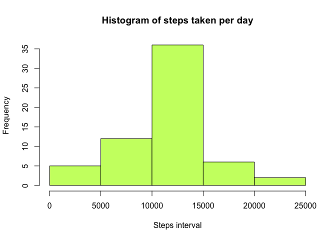

# Reproducible Research: Peer Assessment 1


## Loading and preprocessing the data

```r
activity<- read.table("activity.csv", sep = ",", stringsAsFactors = FALSE , 
                      header =TRUE)
```

## What is mean total number of steps taken per day?
- Calculate the total number of steps taken per day aggregate function is used
- hist function is used to plot an histogram
- aggregate and merge functions used to get a report of mean and median for each steps taken

1. calculate the total number steps taken per day


```r
  sum_daywise_activity<- aggregate(steps~date, activity, FUN = sum, 
                                   na.action  = na.omit)
```

2. Make a histogram of the total number of steps taken each day


```r
  hist(sum_daywise_activity$steps, xlab = "total number of steps taken each day", 
       main  =  "total number of steps taken each day")
```

 

3. Calculate and report the mean and median of the total number of steps taken per day


```r
   mean(sum_daywise_activity$steps)
```

```
## [1] 10766.19
```

```r
   median(sum_daywise_activity$steps)
```

```
## [1] 10765
```

## What is the average daily activity pattern?
1.  Make a time series plot (i.e. type = "l") of the 5-minute interval (x-axis) and the average number of steps taken, averaged across all days (y-axis)


```r
     mean_daywise_activity<- aggregate(steps~interval, activity, FUN = mean, na.action = na.omit)

  with(mean_daywise_activity,plot(interval, steps, type = "l", xlab = "5 minute interval", ylab = "average number of steps", main = " time series plot of the 5-minute interval", xlim = c(0,2500)))
```

 

2.Which 5-minute interval, on average across all the days in the dataset, contains the maximum number of steps?


```r
mean_daywise_activity[which(mean_daywise_activity$steps == max(mean_daywise_activity$steps, na.rm = TRUE)),]
```

```
##     interval    steps
## 104      835 206.1698
```

## Imputing missing values
1.  Calculate and report the total number of missing values in the dataset (i.e. the total number of rows with NAs)


```r
  na_activity<-is.na(activity$steps)
sum(na_activity==TRUE)
```

```
## [1] 2304
```
2. Create a new dataset that is equal to the original dataset but with the missing data filled in.


```r
steps_data <- data.frame(activity$steps)
steps_data[is.na(steps_data),] <- ceiling(tapply(activity$steps, activity$interval, mean, na.rm=TRUE))
filled_activity <- cbind(steps_data, activity[,2:3])
```
3.Make a histogram of the total number of steps taken each day.


```r
filled_steps_by_date <- aggregate(activity.steps ~ date, filled_activity, sum)
hist(filled_steps_by_date$activity.steps,
     main="Histogram of steps taken per day",
     xlab="Steps interval",
     col="darkolivegreen1"
)
```

 

4.Calculate and report the mean and median total number of steps taken per day.


```r
mean(filled_steps_by_date$activity.steps)
```

```
## [1] 10784.92
```

```r
median(filled_steps_by_date$activity.steps)
```

```
## [1] 10909
```
## Are there differences in activity patterns between weekdays and weekends?

1. Create a new factor variable in the dataset with two levels - weekday and weekend indicating whether a given date is a weekday or weekend day.


```r
check_daytype<-function(day){
if(weekdays(as.Date(day)) %in% c("Sunday","Saturday")){
   day<-"weekend"
}
else
 {
   
 day <-"weekday"
 }
  
}
daytype<-data.frame(sapply(activity$date,check_daytype))
 activity_new<-cbind(activity,daytype)
 
 colnames(activity_new) <- c("steps","date","interval","daytype")
```
2. Make a panel plot containing a time series plot of the 5 minute interval (x-axis) and the average number of steps taken, averaged across all weekday days or weekend days (y-axis).


```r
mean_daywise_activity_weekday<- aggregate(steps~interval, activity_new[activity_new$daytype == "weekday",], FUN = mean, na.action = na.omit)

mean_daywise_activity_weekend<- aggregate(steps~interval, activity_new[activity_new$daytype == "weekend",], FUN = mean, na.action = na.omit)

par(mfrow = c(1,2))
with(mean_daywise_activity_weekday,plot(interval, steps, type = "l",main = "Activity on weekdays", xlab = "5 minute interval", ylab = "Average number of steps", xlim = c(100,2500)))
with(mean_daywise_activity_weekend,plot(interval, steps, type = "l",  main = "Activity on weekends", xlab = "5 minute interval", ylab = "Average number of steps",xlim = c(100,2500)))
```

 
